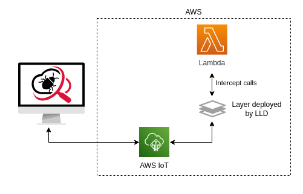

# 

Lambda Live Debugger is an indispensable tool for debugging AWS Lambda functions from your computer, even though they are deployed in the cloud. It supports Lambdas written in JavaScript or TypeScript. It is free and open source.

This tool offers similar functionality to [SST](https://sst.dev/) and [Serverless Framework v4](https://www.serverless.com/blog/serverless-framework-v4-general-availability), with the addition of an Observability Mode.

It supports the following frameworks:

- AWS CDK v2
- Serverless Framework v3 (SLS) and [osls fork](https://github.com/oss-serverless/serverless)
- AWS Serverless Application Model (SAM)
- Terraform and OpenTofu
- Any other framework or setup by implementing a simple function in TypeScript
- ... (Need support for another framework? Let me know!)

[](https://www.youtube.com/watch?v=BrhybwyDM0I)

## Why?

Serverless is amazing and solves many issues with traditional systems. However, writing code for Lambda functions can be challenging. The cycle of writing, deploying, running, fixing, and redeploying is time-consuming and tedious. You could use tools to run Lambda locally or use unit/integration tests; those approaches often don't replicate the actual environment closely enough.

Lambda Live Debugger provides several features that aren't supported by SST or Serverless Framework v4::

- **Observability mode** – Enables debugging without impacting the system, so it can even be used in production.
- **Quick toggle** – Debug mode can be turned off and back on almost instantly without requiring a redeploy like other solutions.
- **Selective debugging** – You can debug only one or a few functions at a time, which is crucial for large and complex systems. Running many Lambdas simultaneously on a single machine can be confusing and can slow down your computer.

## How It Works

Lambda Live Debugger connects to your deployed Lambda, routes requests to your computer, and sends responses back to the deployed Lambda. This allows you to debug locally, but the system behaves as if the code is running in the cloud with the same permissions. In case of code changes, you do not have to redeploy. The code is reloaded automatically without deploying or even restarting the debugger.

The tool attaches Lambda Extensions (via a Layer), intercepts, and relays calls to AWS IoT. AWS IoT transfers messages between your Lambda and the local machine. If the Lambda is written in TypeScript, it's transpiled to JavaScript. The code is executed via the Node Worker Thread.



AWS keys generated on the cloud for Lambda are transferred to the local environment, so the code has the same permissions as it would executed on the cloud. There could be a difference in packaging, mainly regarding static files, which are probably in different locations. You can use additional environment variables to adjust the code:

- `IS_LOCAL = true` = Lambda is executed locally
- `LOCAL_PROJECT_DIR` = directory of the project

### Infrastructure Changes

Lambda Live Debugger makes the following changes to your AWS infrastructure:

- Deploys the Lambda Layer
- Attaches the Layer to each Lambda you're debugging
- Adds a policy to the Lambda Role for AWS IoT access

In case you do not want to debug all functions and add the Layer to them, you can limit to the ones you need via the `function` parameter.

The tool generates temporary files in the `.lldebugger` folder, which can be deleted after debugging. The wizard can add `.lldebugger` to `.gitignore` for you.

## Help and Feedback

**The tool has been thoroughly tested across many scenarios. It is flexible and can be adjusted to fit almost any setup. However, projects and TypeScript settings can be configured in numerous ways. If you need help or encounter a bug, please let me know by opening a [GitHub Issue](https://github.com/ServerlessLife/lambda-live-debugger/issues). This will not only help you but also others, because I can improve the tool and the documentation.**


If the tool is working well for you, please fill out the general [FEEDBACK FORM](https://forms.gle/v6ekZtuB45Rv3EyW9). This helps me understand the interest in the tool and encourages further development.

You can also contact me via [LinkedIn](http://www.linkedin.com/in/marko-serverlesslife) or email [marko@serverlesslife.com](mailto:marko@serverlesslife.com). Please check out my blog: [www.serverlesslife.com](https://www.serverlesslife.com) and follow me on [X (Twitter)](https://twitter.com/ServerlessL).

### Reporting an Issue

- Make sure the bug hasn't already been reported. If you find that it has been, add a "+1" comment so that I know there are multiple users struggling with the same issue. If possible, add some additional info.
- **Enable verbose logging and provide the full log.**
- **Specify the exact framework version (CDK, SLS, SAM ...) and the exact Lambda Live Debugger version.**
- Describe your setup in detail, or better yet, provide a sample project.

## Getting Started

### Installation

Install globally:

```
npm install lambda-live-debugger -g
```

_(On Linux and Mac: `sudo npm install lambda-live-debugger -g`)_

or locally

```
npm install lambda-live-debugger
```

_(If installed locally, you must prefix all commands with `npx`, if they are not part of `scripts` in `package.json`.)_

### Running the Debugger

With default profile, region, and other default settings:

```
lld
```

You probably need to tweak some settings. You can do it via CLI parameters or, even better, run the wizard:

```
lld -w
```

The configuration is saved to `lldebugger.config.ts`.

## CLI Parameters

```
 -V, --version                   output the version number
 -r, --remove [option]           Remove Lambda Live Debugger infrastructure. Options: 'keep-layer' (default), 'all'. The latest also removes the Lambda Layer
 -w, --wizard                    Program interactively asks for each parameter and saves it to lldebugger.config.ts
 -v, --verbose                   Verbose logging
 -c, --context <context>         AWS CDK context (default: [])
 -s, --stage <stage>             Serverless Framework stage
 -f, --function <function name>  Filter by function name. You can use * as a wildcard
 -m, --subfolder <subfolder>     Monorepo subfolder
 -o, --observable                Observability mode
 -i --interval <interval>        Observability mode interval (default: "3000")
 -a --approval                   User approval required for AWS infrastructure changes, like adding a Lambda layer
 --config-env <evironment>       SAM environment
 --sam-config-file <file>        SAM configuration file
 --sam-template-file <file>      SAM template file
 --sam-stack-name <name>         SAM stack name;
 --profile <profile>             AWS profile to use
 --region <region>               AWS region to use
 --role <role>                   AWS role to use
 --framework <framework>         Framework to use (cdk, sls, sam, terraform)
 --gitignore                     Add .lldebugger to .gitignore
 -h, --help                      display help for command
```

## Configuration File

Example `lldebugger.config.ts`:

```typescript
import { type LldConfigTs } from 'lambda-live-debugger';

export default {
  framework: 'cdk',
  context: ['environment=development'],
  region: 'eu-central-1',
  observable: false,
  verbose: false,
  //getLambdas: async (foundLambdas) => {
  //  you can customize the list of Lambdas here or create your own
  //  return foundLambdas;
  //},
} satisfies LldConfigTs;
```

The settings are the same as for the CLI parameters.

### Debugging

You might want to configure your development tool for debugging. The wizard automatically configures for VsCode in `.vscode/launch.json`. Here is an example:

```json
{
  "version": "0.2.0",
  "configurations": [
    {
      "name": "Lambda Live Debugger",
      "type": "node",
      "request": "launch",
      "runtimeExecutable": "${workspaceFolder}/node_modules/.bin/lld",
      "runtimeArgs": [],
      "console": "integratedTerminal",
      "skipFiles": ["<node_internals>/**"],
      "env": {}
    }
  ]
}
```

Now, you have to press F5 or press Run -> Start Debugging, and you can set breakpoints, step through lines of code, inspect variables... For more information on how to [debug in VSCode, please refer to this link](https://code.visualstudio.com/docs/editor/debugging).

The wizard also creates a configuration for JetBrains IDEs, such as WebStorm.

## Removing

When you no longer want to debug and want Lambda to execute the code deployed to the cloud, you need to remove the Lambda Live Debugger:

```
lld -r
```

This detaches the Layer from your Lambdas and removes the IoT permission policy. It will not remove the Layer because others might use it.

To also remove the Layer:

```
lld -r=all
```

## Development Process

Since you deploy code to a real AWS account, it's best to have a dedicated environment only for yourself. It could be your personal environment or an environment created for a feature. That is [common practice when developing serverless systems](https://theburningmonk.com/2019/09/why-you-should-use-temporary-stacks-when-you-do-serverless/). If that's not feasible due to organizational or technical reasons, use Observability Mode.

## Observability Mode

In Observability Mode, Lambda Live Debugger intercepts requests and sends them to your computer without waiting for a response. The Lambda continues as usual. The response from your machine is ignored. This mode can be used in the development, testing, or even, if you are adventurous, production environment. It samples requests every 3 seconds by default (configurable with an `interval` setting) to avoid overloading the system.

## Monorepo Setup

Set the `subfolder` parameter if your framework is in a subfolder.

## Frameworks

### AWS CDK v2

Use the `context` parameter to pass context to your CDK code. This is a common way to pass variables to your code, most often the environment name.

### Serverless Framework v3 (SLS) and [osls fork](https://github.com/oss-serverless/serverless)

Use the `stage` parameter to pass the stage/environment name.

_Serverless, Inc. has deprecated Serverless Framework v3, and v4 is available under a commercial license. Fortunately, **[an open-source fork of version 3](https://github.com/oss-serverless/serverless) is available and remains actively maintained. Lambda Live Debugger supports both the official v3 and the fork**, but not v4, which has its own debugging solution._

### AWS Serverless Application Model (SAM)

Use the `config-env` parameter to pass the stage/environment name.

### Terraform and OpenTofu

Multiple configurations are supported, including [serverless.tf](https://serverless.tf/) framework. You can explore [relevant test cases here](https://github.com/ServerlessLife/lambda-live-debugger/tree/main/test/terraform-basic).

If you use TypeScript, Lambda Live Debugger should automatically locate source files, even when they are transpiled to JavaScript.

If you encounter an unsupported configuration, please open a [GitHub Issue](https://github.com/ServerlessLife/lambda-live-debugger/issues).

### Custom Setup

Configuration file `lldebugger.config.ts` enables you to modify the list of Lambdas, change the code path, esBuild configuration, or provide your own list of Lambdas, thereby support **any framework**. For this to work, install Lambda Live Debugger locally in the project.

```typescript
getLambdas: async (foundLambdas, config) => {
  //you can customize the list of Lambdas here or create your own
  return foundLambdas;
};
```

**Filter list of functions:**

```typescript
getLambdas: async (foundLambdas, config) => {
  return foundLambdas?.filter((l) => l.functionName.includes('myfunction'));
};
```

**Modify code path:**\
For example, when the framework only has a list of JavaScript files, but you transpiled them from TypeScript with your own solution.

```typescript
getLambdas: async (foundLambdas, config) => {
  if (foundLambdas) {
    for (const lambda of foundLambdas) {
      lambda.codePath = lambda.codePath
        .replace('/dist/', '/src/')
        .replace('.js', '.ts');
    }
  }
  return foundLambdas;
};
```

**Modify esBuild configuration:**

```typescript
import { type EsBuildOptions, type LldConfigTs } from "lambda-live-debugger";

export default {
  ...
  getLambdas: async (foundLambdas, config) => {
    if (foundLambdas) {
      for (const lambda of foundLambdas) {
        lambda.esBuildOptions = {
          target: "node14",
        };
      }
    }
    return foundLambdas;
  }
} satisfies LldConfigTs;
```

**Provide your own list of Lambdas and support any framework**:

```typescript
export default {
  //framework: <-- you do not need this line
  ...
  getLambdas: async (foundLambdas, config) => {
    return [
      {
          // function name as deployed on AWS
          functionName: "mystack-myfunction",
          codePath: "/src/myLambda.ts",
      },
    ];
  },
} satisfies LldConfigTs;
```

**Modify existing framework support:**

```typescript
import { CdkFramework, type LldConfigBase, type LldConfigTs } from "lambda-live-debugger";

class MyCdkFramework extends CdkFramework {
  override getCdkContext(cdkConfigPath: string, config: LldConfigBase) {
    // your implementation
  }
}

export default {
  ...
  getLambdas: async (foundLambdas, config) => {
    return new MyCdkFramework().getLambdas(config);
  }
} satisfies LldConfigTs;s
```

## Known Issues

Check the [GitHub issues](https://github.com/ServerlessLife/lambda-live-debugger/issues).

## Missing Features

For the current list of missing features, please refer to the [GitHub issues](https://github.com/ServerlessLife/lambda-live-debugger/issues) page. The most significant missing features at the moment are MFA authentication and additional Terraform configurations.

If you have a new feature idea, please create and issue.

## Authors

- [Marko (ServerlessLife)](https://www.serverlesslife.com/)
- ⭐ Your name here for big code contributions.

## Contributors

(alphabetical)

- [Ben Moses](https://github.com/benjymoses)
- [Kristian Dreher](https://www.linkedin.com/in/kristiandreher)
- [Roger Chi](https://rogerchi.com/)
- [Sebastian / avocadomaster](https://github.com/avocadomaster)
- [Sebastian Bille](https://blog.sebastianbille.com)
- [Quentin Laurent](https://github.com/Spotchi)
- ⭐ Your name here for notable code or documentation contributions or sample projects submitted with a bug report that resulted in tool improvement.

## Disclaimer

Lambda Live Debugger is provided "as is," without warranty of any kind, expressed or implied. Use it at your own risk, and be mindful of potential impacts on performance, security, and costs when using it in your AWS environment.
