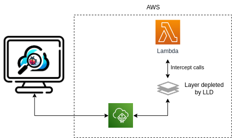

# Lambda Live Debugger


Lambda Live Debugger is an indispensable tool that allows you to debug AWS Lambda from your computer, although it is deployed on the cloud. It supports Lambdas written in JavaScript or TypeScript.

This is essentially the same as offered by [SST](https://sst.dev/) and [Serverless Framework v4](https://www.serverless.com/blog/serverless-framework-v4-general-availability), except it supports an additional Obserability mode.

It supports the following frameworks:

- AWS CDK v2,
- Serverless Framework v3 (SLS),
- AWS Serverless Application Model (SAM),
- Terraform,
- by implementing a simple function and option to support any framework or setup you might have,
- ... (if you need any other framework, let me know?)

## Early alpha state

**Currently, the project is in the early alpha state. Please let me know if everything works for you. A simple message would help a lot, so I know I am on the right track. I tested many scenarios, but there are numerous ways how people can configure projects and TypeScript configuration. The tool is flexible enough, so the settings can be tweaked to adjust your setup without implementing additional features. Any advice on how to improve the project is also very welcome.**

You can contact me by:

- [Open GitHub issue](https://github.com/ServerlessLife/lambda-live-debugger/issues)
- [LinkedIn](http://www.linkedin.com/in/marko-serverlesslife)

## The problem statement

The serverless is amazing and resolves many issues that regular systems face. But writing code can be a struggle. You write code, deploy, run, fix, deploy again. That process is time-consuming and tiresome. You can also use one of the tools for running code locally or use unit/integration tests for that, but that has many other issues, and it does not mimic an actual environment close enough.

## How does it work

It connects to your deployed Lambda, sends the request to your computer, and sends the response back to Lambda. This way, you can debug on your machine, but the system behaves as if the code is running in the cloud with the same permissions.

Lambda Live Debugger attaches Lambda Extensions (via Layer) to the Lambda to intercept calls and send them to AWS IoT. AWS IoT is used to transfer messages to and from your machine. Lambda Live Debugger runs locally, connects to the AWS IoT, and executes the code locally. If Lambda is written in TypeScript, it is transpiled to JavaScript. Calls are executed via Node Worker Threads.



Lambda Live Debugger makes the following changes to your AWS infrastructure:

- Lambda excentions as a Layer
- Attach Layer to each Lambda that you are debugging
- Add policy to Lambda Role to use AWS IoT

In case you do not want to add Layer to all functions, you can limit to the ones you need via configuration parameters.

While compiling, it creates many temporary files in the folder `.lldebugger`; you can freely delete the folder once you are done debugging or add `.lldebugger` to `.gitignore`. The wizard adds that for you if you want.

## Your developing process with Lambda Live Debugger

Since you will be deploying code into an actual AWS account while developing, you must use that environment only for yourself or create a temporary environment for you or for a feature you are working on.

Unfortunately, having a separate AWS environment is not always possible because of organizational issues (it is 2024, and companies still do not understand how to work with serverless) or technical issues (it is hard to duplicate databases or other parts of the system). For that purpose, there is an Observability Mode.

## Observability Mode

In Observability Mode, Lambda Live Debugger via Lambda Extension just intercepts the request received by Lambda and forwards it to the local environment, but it does not wait for the response. After that, Lambda continues regular execution and ignores the response from the local environment. The system is not impacted, and regular users and other developers can continue to use it. You can run Observability Mode on the development or testing environment. If you are an adventurer, you can even run it in production. In observability mode, you do not get all Lambda requests. You only get one every 3 seconds. You can configure that interval via `interval` setting. This way, the system will not be overloaded if there are a lot of requests coming in.

## How to start

### Installation

Install locally:
`npm install lambda-live-debugger`
or globally
`npm install lambda-live-debugger -g` (Linux, Mac: `sudo npm install lambda-live-debugger -g`)

### How to run

If you use the default profile, default region, and other default settings then just run:

`lld` or `npx lld` (if installed locally)

But you probably need to tweak some settings. You can do it via CLI parameters or, better run a wizard. The configuration is saved to `lldebugger.config.ts`

`npx lld -w` or `lld -w` (if installed globally)

### CLI parameters

```
 -V, --version                   output the version number
 -r, --remove [option]           Remove Lambda Live Debugger infrastructure. Options: 'keep-layer' (default),
 'remove-all'
 -w, --wizard                    Program interactively asks for each parameter
 -v, --verbose                   Verbose logs
 -c, --context <context>         AWS CDK context (default: [])
 -s, --stage <stage>             Serverless Framework stage
 -f, --function <function name>  Filter by function name
 -m, --subfolder <subfolder>     Monorepo subfolder
 -o, --observable                Observable mode
 -i --interval <interval>        Observable mode interval (default: "3000")
 --config-env <evironment>       SAM environment
 --profile <profile>             AWS profile to use
 --region <region>               AWS region to use
 --role <role>                   AWS role to use
 --framework <framework>         Framework to use (cdk, sls, sam, terraform)
 --gitignore                     Add .lldebugger to .gitignore
 -h, --help                      display help for command
```

### Debugging

You might want to configure your development tool for debugging. The wizard automatically configures for VsCode in `.vscode/launch.json`. Here is an example:

```
{
 "version": "0.2.0",
 "configurations": [

 {
 "name": "Lambda Live Debugger",
 "type": "node",
 "request": "launch",
 "runtimeExecutable": "${workspaceFolder}/node_modules/.bin/lld",
 "runtimeArgs": [],
 "console": "integratedTerminal",
 "skipFiles": [
 "<node_internals>/**"
 ],
 "env": {}
 },
 ]
}
```

If you are using another tool, please send me documentation so I can include it here. Especially the instruction for WebStorm is needed.

### Monorepo

If your framework is one of the subfolders, set the `subfolder˙ setting.

## Custom configuraiton

getLambdas: async (foundLambdas) => {
//you can customize the list of lambdas here or create your own
//return foundLambdas;
},

## Removing

You can remove Lambda Live Debugger from your AWS account by running:
`lld -r` (`npx lld -r` if installed locally)

This will detach the Layer from your Lambda and remove the additional IoT permission policy.

It will not remove the Layer as others might use it. You can do everything, including Layer, with:
`lld -r=all` (`npx lld -r=all` if installed locally)

## AWS CDK v2

`context` is an additional setting for CDK. This is a common way to pass various variables to your code, most often the environment name.

## Serverless Framework v3 (SLS)

`stage` is an additional setting for SLS to pass the stage/environment name to SLS.

## AWS Serverless Application Model (SAM)

`config-env` is an additional setting for SAM to pass the stage/environment name to SLS.

## Terraform

Only the most basic setup for Terraform is supported. Check the test case [in](https://github.com/ServerlessLife/lambda-live-debugger/tree/main/test/terraform-basic).

I am not a Terraform developer, so I only know the basics. Please provide a project sample so I can build better support.

## Know issues

## Missing features

Please check the open [issues](https://github.com/ServerlessLife/lambda-live-debugger/issues).

The most important missing feature is MFA authentication and the most possible configuration for Terraform.

## Reporting an issue

- Make sure the bug is not already reported. Add +1 comment so I know there are multiple users struggling with the same issue. If possible, add some additional info.
- Make a descriptive title with the prefix "bug:", "help:", "feature:", "discussion:" to indicate if you find a bug, need help, propose a feature... Please also add the matching label and, if needed, set priority via label.
- Turn on verbose logging and provide the whole log.
- Carefully describe your setup, or even better, provide a sample project.

## Authors:

- [Marko (ServerlessLife)](https://github.com/ServerlessLife)
- ⭐ place for you for large code contribution

## Contributors (alphabetical)

- ⭐ place for you for smaller code/documentation contributions or a sample project as a part of a bug report

## Declarment

Use this tool at your responsibility...
